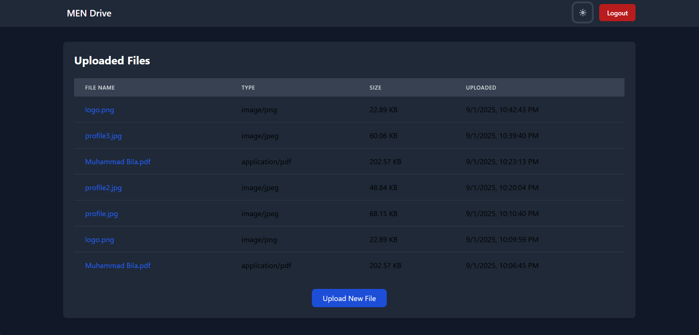

# MEN-Drive 🚀  
*A File Storage and Sharing Platform built with MongoDB, Express.js, and Node.js*


## 📌 Project Overview
MEN-Drive is a web-based file storage solution that enables users to **securely upload, store, and manage files**.  
Built with the **MEN stack (MongoDB, Express.js, Node.js)**, the platform features authentication, file access control, and a responsive web interface using **EJS**.

---

## ✨ Features
- 🔐 **User Authentication** – JWT-based secure login & session handling  
- 📂 **File Uploads & Storage** – Handled via Multer with validation  
- 🗂 **User-Specific File Management** – Organize and restrict file access per user  
- 🌐 **Responsive Frontend** – Server-side rendering with EJS  
- 🛡 **Security First** – Access control and protection against unauthorized file access  

---

## 🛠 Tech Stack
- **Backend**: Node.js, Express.js  
- **Frontend**: EJS (Embedded JavaScript Templates)  
- **Database**: MongoDB  
- **Authentication**: JSON Web Tokens (JWT)  
- **File Handling**: Multer  

---

## ⚙️ Installation & Setup
1. Clone the repository:
   ```bash
   git clone https://github.com/your-username/men-drive.git
   cd men-drive
2. Install dependencies:

   ```bash
   npm install
   ```

3. Create a `.env` file in the root directory and configure:

   ```env
   PORT=5000
   MONGO_URI=your_mongodb_connection_string
   JWT_SECRET=your_secret_key
   ```

4. Start the development server:

   ```bash
   npm start
   ```

   Or with nodemon:

   ```bash
   npm run dev
   ```

---

## 📖 Usage

* Register/Login to create a secure account
* Upload files through the dashboard
* View, manage, and organize files tied to your account
* Logout securely when done

---

## 🔒 Challenges & Learnings

* Implemented **JWT authentication** for secure user sessions
* Learned efficient **file handling & storage** using Multer
* Designed proper **access control** for user-specific files
* Optimized **performance for large file uploads**

---

## 📷 Screenshots (Optional)



---

## 🚀 Future Improvements

* 🌍 Cloud storage integration (e.g., AWS S3, Google Cloud Storage)
* 📱 Dedicated mobile-friendly UI/UX
* 🔄 File sharing via links with expiry & permissions
* 📊 Admin dashboard for user & file analytics

---

##  Contributing

Contributions are welcome!

1. Fork the repo
2. Create a feature branch (`git checkout -b feature-name`)
3. Commit changes (`git commit -m "Added feature X"`)
4. Push to branch (`git push origin feature-name`)
5. Open a Pull Request

---

## License

This project is licensed under the **MIT License** – feel free to use and modify it.

---

##  Author

**Muhammad Bilal**
🔗 [LinkedIn](https://www.linkedin.com/in/muhammad-bilal-coder/) | [GitHub](https://github.com/bilal-512)

---


